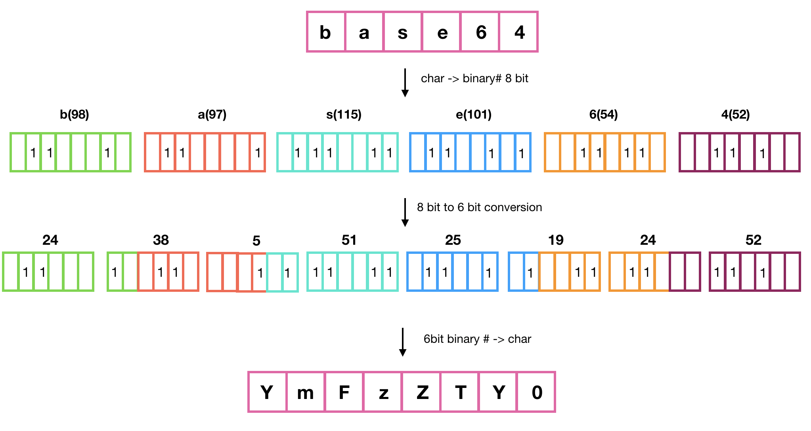
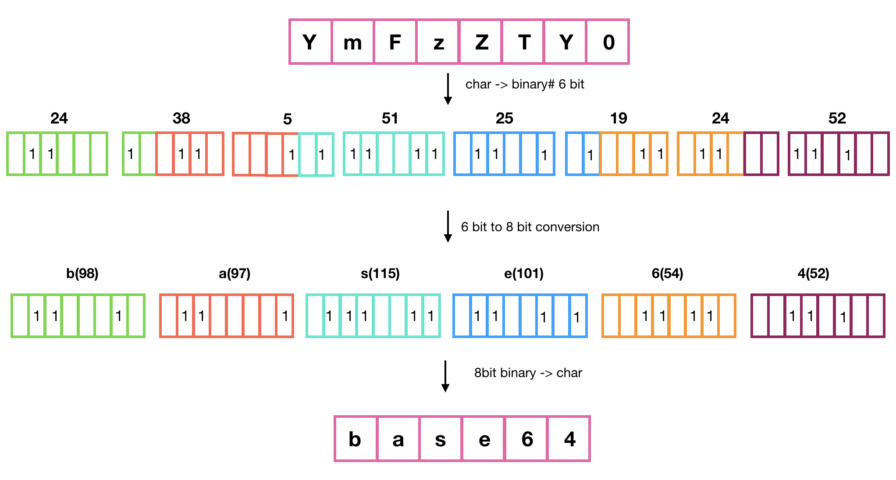

## Base64 란?

8 bit 바이너리 데이터를 문자 코드에 영향 받지 않는 공통 ASCII 영역의 문자들로만 이루어진 6 bit 스트링으로 바꾸는 인코딩 방식이다.
Base64 는 64진법이란 의미로 2의 제곱들에 기반한 진법들중 화면에 표시가 되 ASCII 문자를 써서 표현할수 있는 가장 큰 진법입니다. 
동작 방식은 바이너리 데이터를 스트링으로 변경하는 인코딩 방식이다. Base64 가 담고있는 문자열은 A-Z, a-z, 0-9, + / 을 담고 있다.

- 2진 데이터를 ASCII 형태의 문자로 표현
- 웹 인증 중 기본 인증에서 사용
- 데이터를 6 bit 단위로 표현

### ✅ **동작 원리**

✔️ **Encoding :**
1. 해당 문자열을 ASCII코드의 10진수 값으로 바꿉니다.
2. 8 비트 바이너리 데이터를 6비트 크기로 쪼개어 줍니다.
   ** 비트 변환시 범위 충돌을 막기 위해 8 bit 와 6 bit 의 최소 공배수인 24 bit 단위 묶음으로 변환
3.  해당 데이터를 10진법으로 읽어들여 Base64의 알파벳으로 바꿉니다.

 

✔️ **Decoding:**
1. Base64로 된 해당 문자열 10진수 값으로 바꿉니다.
2. 6비트 바이너리 데이터를 8비트 크기로 나누어 줍니다.
3. 해당 데이터를 10진법으로 읽어들여 ASCII 코드의 알파벳으로 바꿔줍니다.
 
 
  

### ✅ Base64 를 사용하는 이유?
Base64 를 쓰게 되면 데이터가 커지는데 이용하는 이유는, 웹상에서 공통적으로 사용할 수 있는 기능 때문이다.
Base63 는 텍스트 데이터가 매체를 통해 저장되고 전송되야할 경우 사용한다. 인코딩을 통해 데이터가 전송시에 변동되지 않도록 보존시켜줍니다.
바이너리 데이터를 텍스트로 다루고 싶을 때 사용하면 좋은 방식이다.

**이용 예시 :**
- email / MIME, XML 혹은 JSON 데이터
  
- 바이너리 데이터를 RDMS 에 저장하고 싶을때 종류에 따라 SQL 구문에 이진데이터를 지원하지않는 경우가 있기 때문에 바이너리 데이터를 텍스트로 바꿔준다.
- xml 은 파싱할때 이미지를 base64로 파싱
